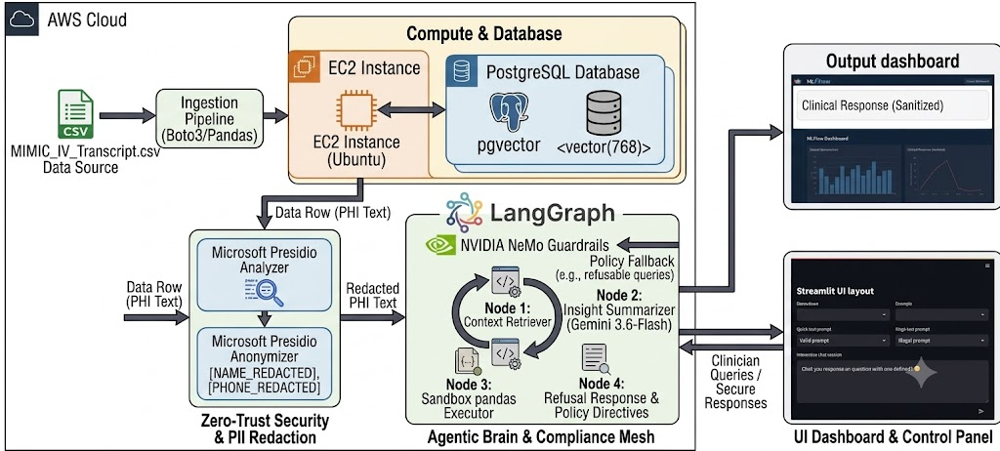

# Secure-Clinical-Insights-Engine

An enterprise-ready, zero-trust hybrid semantic search and retrieval infrastructure pipeline deployed on **AWS (Asia Pacific - Mumbai region)** hosting an **Ubuntu EC2** instance integrated with a tuned **PostgreSQL database engine** extended with **pgvector** for hybrid semantic AI Electronic Health Record (EHR) workloads.

---

## 🏗️ System Architecture & Workflow Pipeline



## 📝 Project Executive Summary

The **Secure-Clinical-Insights-Engine** is a smart, ultra-secure digital assistant built for doctors and healthcare teams. It allows clinicians to type natural questions to search through large volumes of patient medical charts stored in a secure cloud server (**Amazon Web Services**). The system instantly reads the history to find exact facts, while using advanced safety systems to protect patient privacy and prevent medical errors.

### 🌟 What this project actually does:

- **Finds Information Instantly:** Instead of manually searching through thousands of rows of old medical files, a doctor can simply type a question (like _"What medication did this patient receive earlier?"_). The system uses specialized AI to understand the medical meaning behind the question and pulls up the exact matching records.
- **Hides Private Patient Details:** Before any information is sent to the AI model to generate an answer, a digital privacy screen (**Microsoft Presidio**) instantly scrubs out personal details like patient names, phone numbers, or addresses. This ensures patient data always stays anonymous and secure.
- **Acts as a Safety Guardrail:** The AI is equipped with a built-in medical safety wall (**NVIDIA NeMo Guardrails**). If a doctor asks a safe question about a patient's past chart history, the AI answers it perfectly. However, if someone tries to ask the AI for prescription advice or medication changes, the guardrail instantly steps in and blocks the response, saying it cannot give clinical advice.
- **Easy-to-Use Screen Dashboard:** Doctors do not have to write code or use confusing terminals. Everything is wrapped inside a clean, easy-to-read web browser dashboard (**Streamlit**) with clickable sample questions and simple menus.

## 🛠️ Infrastructure Setup Summary

### 1. Compute & Storage (AWS EC2)

- **Instance Type:** `t2.micro` (1 vCPU, 1 GiB RAM) [AWS Free Tier compliant] acting as the unified application server and secure database host.
- **Storage:** **20GB General Purpose SSD (gp3)** root storage volume.
- **Elastic IP:** Static permanent public IPv4 address (**`3.7.80.38`**) ensures network persistence across server reboots so that downstream database components or backend configurations remain unbroken.

### 2. Network Firewall (Security Groups)

- **`clinical-FDE-Database`** custom security group explicitly tied to the project VPC network.
- **Inbound Rules:**
  - **SSH (Port 22):** Locked down specifically to your local workstation's active public IP address (`My IP`) for secure shell administration.
  - **PostgreSQL (Port 5432):** Inbound connection access locked down dynamically to your workstation's specific public IP to allow isolated remote client database streaming.
  - **HTTP (Port 80):** Opened globally (`0.0.0.0/0`) to allow application web traffic interfaces.

---

## 💻 Local Workspace Configuration (Windows Client)

All local project management operations are executed from the native target folder path:
`PS D:\2026\newstudy\projects\Secure-Clinical-Insights-Engine`.

1. **Private Key Privilege Isolation:** Windows inheritance permissions are stripped from `clinical.pem` to grant exclusive read/write access to the active user account via `icacls.exe`:

   ```powershell
   # Reset permissions and drop inheritance allocations from generic system groups
   icacls.exe "D:\2026\newstudy\projects\Secure-Clinical-Insights-Engine\clinical.pem" /reset
   icacls.exe "D:\2026\newstudy\projects\Secure-Clinical-Insights-Engine\clinical.pem" /inheritance:r

   # Grant exclusive full read/write privileges strictly to your logged-in Windows account
   icacls.exe "D:\2026\newstudy\projects\Secure-Clinical-Insights-Engine\clinical.pem" /grant:r "$($env:USERNAME):(F)"
   ```

2. **Isolated Workspace:** Python virtual environment (`clinicenv`) created and activated on the D drive to bypass volume storage thresholds on the primary system boot drive (C:):

   ```powershell
   # Create the local python virtual environment path natively
   python -m venv clinicenv

   # Activate the localized platform runtime environment shell workspace
   clinicenv\Scripts\activate
   ```

3. **Core Framework Ingestion:** Dependencies installed via `requirements.txt`, including `sentence-transformers`, `tqdm`, `torch`, `google-genai`, `langchain`, `langchain-core`, `langchain-google-genai`, `langchain-community`, and `nemoguardrails`.
   ```powershell
   pip install -r requirements.txt
   pip install sentence-transformers tqdm torch google-genai langchain langchain-core langchain-google-genai langchain-community nemoguardrails
   ```

---

## 🔌 Remote Connection & Database Management

- **EC2 Connection:** Establish a secure remote shell session from your local Windows terminal terminal prompt utilizing the isolated key string:
  ```bash
  ssh -i clinical.pem ubuntu@3.7.80.38
  ```
  _Note: To prevent server timeout connection drops during long administrative periods, execute utilizing the keep-alive heartbeat arguments string:_
  ```bash
  ssh -o ServerAliveInterval=60 -i clinical.pem ubuntu@3.7.80.38
  ```
- **PostgreSQL Service:** Linux system service control daemons are strictly **case-sensitive**. All administration utilities must target entirely lowercase strings (`postgresql`):

  ```bash
  # Query the system logs for the explicit cluster manager instance
  sudo systemctl status postgresql@14-main

  # Restart the database instance engine to pull configuration changes
  sudo systemctl restart postgresql@14-main
  ```

  _Note: If a status tracking readout enters the `less` paging viewer terminal view, press **`q`** on your keyboard to instantly return to your active Ubuntu shell._

- **Superuser Access:** Log in via `sudo -i -u postgres psql`.
  _Note: Execute **`\q`** inside the database prompt (`postgres=#`) to drop out of the interactive layer and return to your standard Ubuntu shell environment._
- **Database & Role Setup:** Initializes the `ehr_db` database and configures the `fde_admin` administrative user with secure parameters:
  ```bash
  sudo -i -u postgres psql -c "CREATE DATABASE ehr_db;"
  ```
  Executed inside the interactive `psql` console:
  ```sql
  CREATE USER fde_admin WITH PASSWORD 'SecureEHR2026!';
  ALTER ROLE fde_admin SET client_encoding TO 'utf8';
  ALTER ROLE fde_admin SET default_transaction_isolation TO 'read committed';
  ALTER ROLE fde_admin SET timezone TO 'UTC';
  GRANT ALL PRIVILEGES ON DATABASE ehr_db TO fde_admin;
  ```

---

## 📂 Project Architecture & File Manifest

```text
Secure-Clinical-Insights-Engine/
├── data/
│   └── MIMIC_IV_Trasncript.csv        # Baseline raw historical health dataset
├── scripts/
│   ├── 01_ingest_baseline_data.py     # Parses raw CSV sheets into remote AWS Postgres
│   ├── 02_verify_ingestion.py         # Integrity validation & low-overhead telemetry checks
│   ├── 03_apply_vector_schema.py      # Upgrades schema with pgvector data structures
│   ├── 04_generate_embeddings.py      # Batched NeuML BioClinical vector generator loop
│   ├── 05_test_vector_search.py       # Global database vector lookup validation script
│   ├── 06_test_guardrails.py          # Firewalled sandbox check script for safety flow validation
│   ├── 07_run_secure_rag.py           # Production orchestration RAG engine test runner
│   └── 08_find_valid_patient.py       # Diagnostic script identifying active embedded IDs
└── src/
    ├── config.py                      # Dynamic environment variables manager
    ├── inference_engine.py            # Primary Production Zero-Trust Gemini RAG Engine
    ├── database/
    │   ├── connection.py              # SQLAlchemy connection pool session manager
    │   └── schema.sql                 # Structural base DDL database table layouts
    ├── guardrails/
    │   ├── config.yml                 # NeMo Guardrails coordination model configurations
    │   └── rails.co                   # Colang structural intent matching rules
    └── pii_redaction/
        └── presidio_service.py        # Microsoft Presidio scrubber engine for PHI/PII
```

---

## 🐍 Architectural Component Core Logic

### 1. `src/config.py`

Centralized environment variables manager. Leverages `python-dotenv` to scan your hidden root `.env` profile. It pulls operational environment inputs (`DB_USER`, `DB_PASSWORD`, etc.) dynamically into Python system memory and synthesizes the standard PostgreSQL connection URI string used by database engines, isolating secrets out of raw code repositories.

### 2. `src/database/connection.py`

Instantiates the core database connection engine pool and structural session manager. Uses `SQLAlchemy` to build a persistent computational communication pipeline targeting your AWS Elastic IP `3.7.80.38`. It implements advanced operational configurations like `pool_pre_ping=True` (which actively tests connection dropouts over long-distance paths before running scripts) and serves an isolated transactional data handler block (`get_db`) to downstream ingestion code blocks.

### 3. `src/pii_redaction/presidio_service.py`

Microsoft Presidio-based automated data redactor. Utilizes custom regex entities and deny-lists to scrub Personally Identifiable Information (PII) and Protected Health Information (PHI)—such as names, phone numbers, and physical locations—from raw EHR rows extracted from the database before they are processed by external model instances.

### 4. `src/guardrails/`

Contains the NVIDIA NeMo Guardrails safety mesh files to enforce compliance boundaries. The configuration architecture is divided into two key items:

- **`config.yml`**: Configures the main model execution routing framework using the `google_genai` engine mapping to point directly to **Gemini 3.6 Flash**, and sets the embedding lookups to utilize local `SentenceTransformers`.
- **`rails.co`**: Written in Colang. Defines explicit conversational flows to differentiate between valid historical data extractions (allowed) and malicious actions asking for forward-looking prescribing advice/dosage modifications (blocked with a standard refusal warning text string).

### 5. `src/inference_engine.py`

The master execution module of the engine. Coordinates the full zero-trust RAG loop: vectorizes inbound requests, executes the native `pgvector` distance lookup, passes rows to `presidio_service` for PHI redaction, passes the prompt block to NeMo Guardrails, and queries the official Google GenAI SDK natively to return context-grounded insights.

---

## 🚀 Chronological Pipeline Execution Steps

Execute all processes from your root directory terminal window with your virtual environment (`clinicenv`) active.

**Step 1: Deploy Database Schema and Ingest Baseline Data**
Calculates local project paths, extracts data cells from `MIMIC_IV_Trasncript.csv`, converts invalid fields (`NaN`) into database-compliant `NULL` elements, and streams data into AWS via SQLAlchemy.

```cmd
python scripts\01_ingest_baseline_data.py
```

**Step 2: Validate Data Ingestion Integrity**
Performs an optimized SQL `COUNT(*)` operation across the VPC firewall to check total database volume parameters without creating instance memory bottlenecks.

```cmd
python scripts\02_verify_ingestion.py
```

**Step 3: Inject AI Vector Column Schema Upgrades**
Connects to your remote instance and executes a defensive `ALTER TABLE` DDL statement to inject your structural storage field `clinical_embedding` configured as a `vector(768)` data type.

```cmd
python scripts\03_apply_vector_schema.py
```

**Step 4: Generate and Store BioClinical Vector Embeddings**
Loads the `NeuML/bioclinical-modernbert-base-embeddings` transformer model, loops through rows where embeddings are missing, joins column values using pipe (`|`) delimiters, calculates 768-dimensional matrices via PyTorch, and updates rows in bulk.

```cmd
python scripts\04_generate_embeddings.py
```

**Step 5: Test Semantic Vector Search**
Validates your native `pgvector` cosine distance operator (`<=>`) parameters across the VPC firewall by running a complex natural language medical search locally.

```cmd
python scripts\05_test_vector_search.py
```

**Step 6: Verify Mapped Vectors and Diagnostics**
Identifies and outputs a diagnostic list of distinct, valid patient ID keys that have active vector representations stored in the AWS tables.

```cmd
python scripts\08_find_valid_patient.py
```

**Step 7: Validate the Guardrails Firewall Sandbox**
Executes an asynchronous simulation loop using the framework settings parameter to verify that safety rules are tracking correctly:

```cmd
python scripts\06_test_guardrails.py
```

**Step 8: Execute the Production Zero-Trust RAG Pipeline**
Runs the main production execution module. It searches live patient data records, applies Presidio scrubbing, routes through the NeMo Guardrails firewall, and generates insight responses via the Google Gemini API.

```cmd
python -m scripts.07_run_secure_rag
```

### 🔒 Security Best Practices Implemented

- **Zero Secret Disclosure:** Credentials, system IPs, and database access secrets are isolated inside a localized `.env` configuration template.
- **Git Safeguard:** The `.env` file is explicitly listed under the `.gitignore` structure to guarantee critical pipeline keys are never pushed to public repositories.
- **Permanent Windows Configuration Toggle:** To prevent typing environment variables on every terminal reload, the profile uses the permanent system user flag configuration:
  ```cmd
  setx NEMOGUARDRAILS_LLM_FRAMEWORK "langchain"
  ```
- **VPC Isolation Layer:** Database connectivity is protected via AWS Security Groups, locking down traffic on port `5432` and port `22` to the developer's exact active public IP address (`My IP`).
